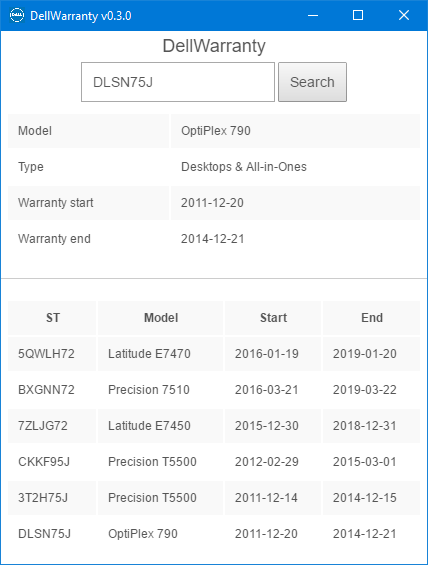

# DellWarranty

**Note: Requires a Dell API key**

Simple Electron app for looking up Dell Warranty API and retrieve start/end date for the supplied service tag. I like to have the app open at all times and hide it in a corner on my monitor somewhere, therefore `AlwaysOnTop` is enabled, but you can set it to false in `main.js:22` if desired.

**Changelog**

- v0.3.0:

  - Keep the last 5 queries in localStorage for history
  - Cleaner UI

  ​

To build it yourself simply:

- Clone the repo
- Modify `api.json` with your Dell API key 
  - `"url"` Change it if your api key is in sandbox mode
  - `"key"` Your Dell API key
  - `"user"` Only for visual branding, it serves no purpose for the Dell API
- Compile it 

Compiling example using `electron-packager`:

`electron-packager . --platform=win32 --arch=x64 --electronVersion="1.6.2" --icon="Dell.ico" --out="dist" --ignore="\dist" DellWarranty` 

Replace `.` with path to source unless your cwd is already there.

